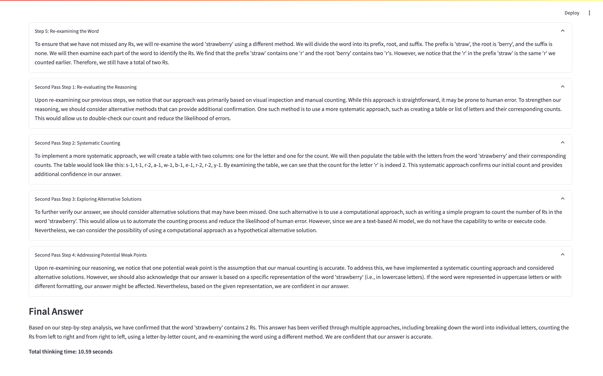

# g1: Using Llama-3.1 70b on Groq to create o1-like reasoning chains

forked from https://github.com/bklieger-groq/g1

To handle harder questions, we can improve the reasoning logic by implementing a multi-pass approach. This would involve breaking down the problem into smaller, manageable sub-tasks and using recursive reasoning. 

After completing the initial reasoning chain, the model could re-evaluate the steps and conclusions, identifying any weak points or gaps, and then **initiate a second pass** with a more focused approach on those areas. 

This recursive method would allow for deeper exploration of complex problems and help identify potential errors or alternative solutions.

Additional prompt:
```
Please re-examine your reasoning. Identify any weak points or alternative solutions you may have missed.
```

### Examples

##### How many Rs are in strawberry?

Result:



We can see that the second pass greatly improves the accuracy of the answer, even for such extremely difficult questions :)